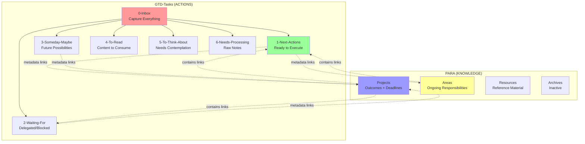
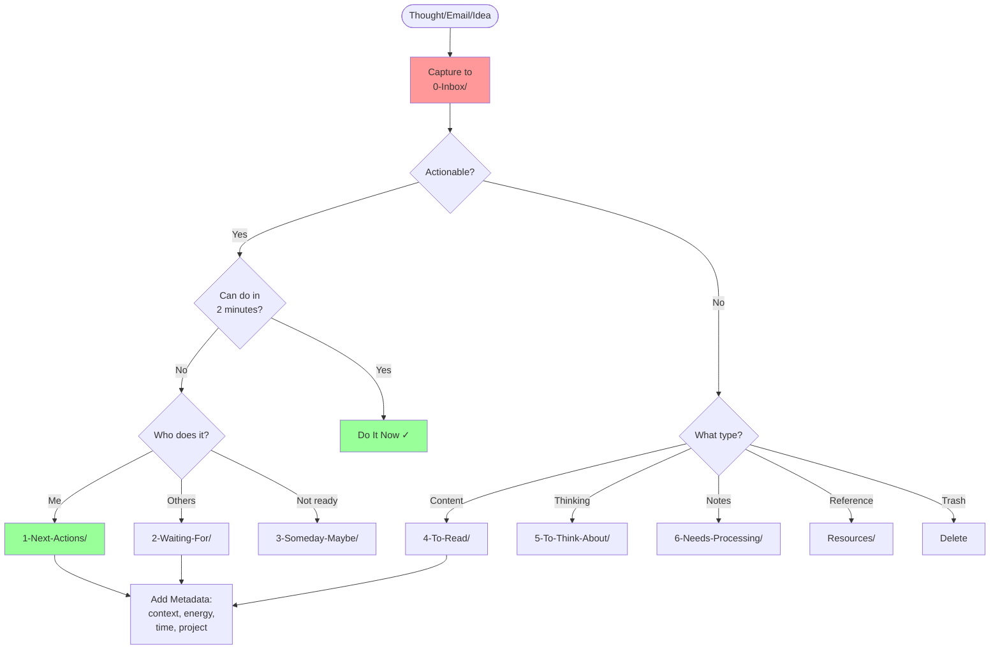
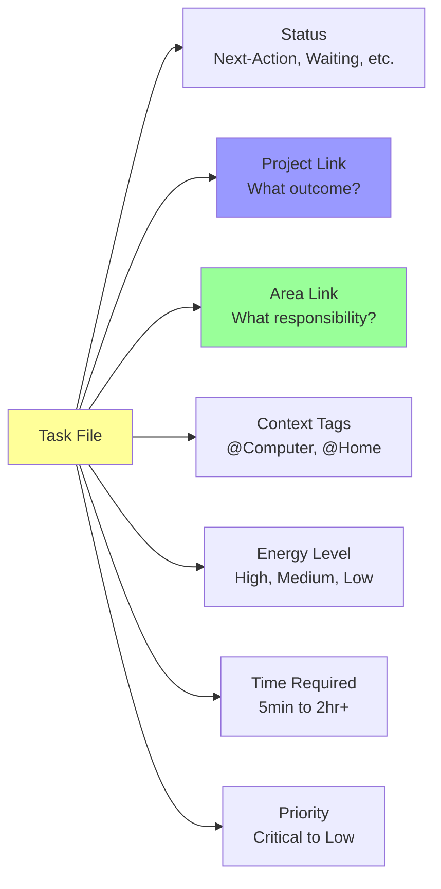
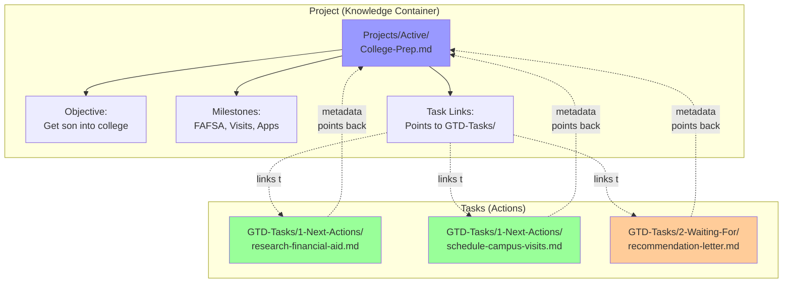
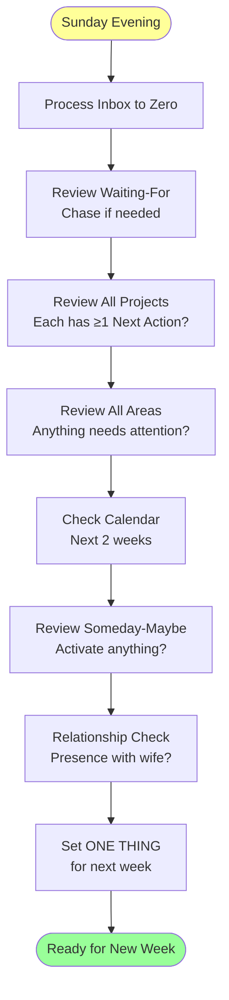
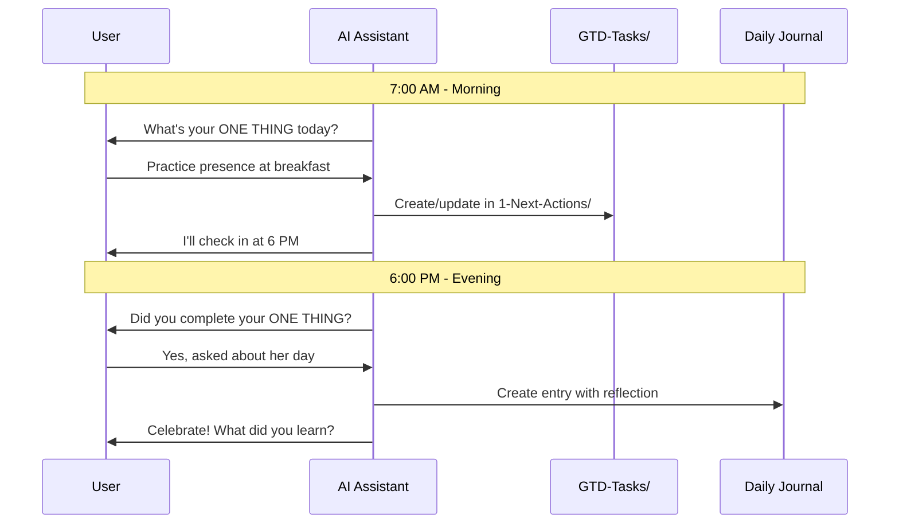
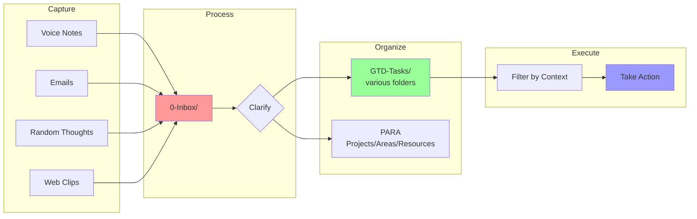
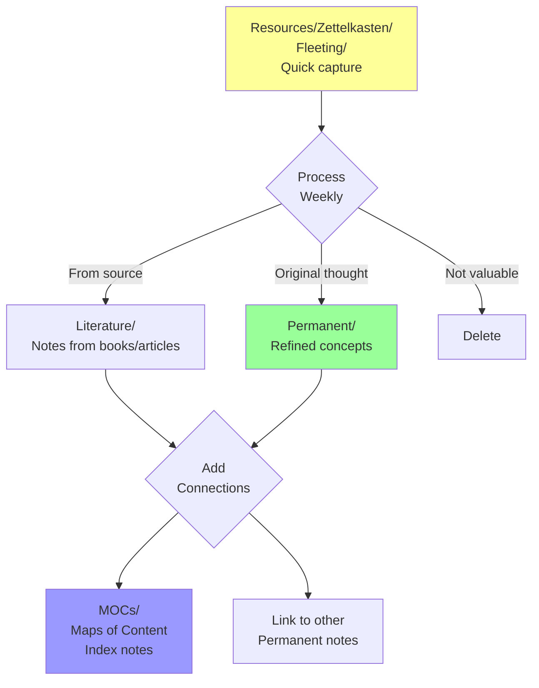
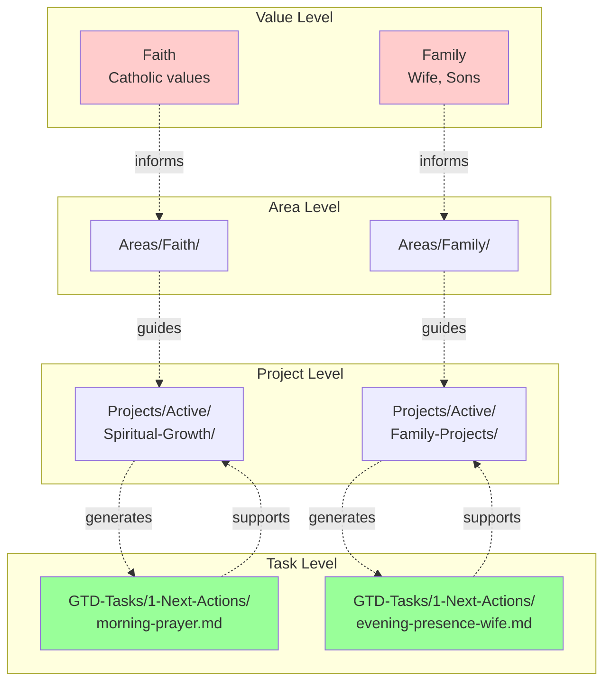

# LifeOS Visual Guide
**Quick Reference for System Structure and Workflows**

---

## System Architecture Overview



---

## Capture → Process Workflow



---

## Task Metadata Structure



---

## How Projects and Tasks Connect



---

## Weekly Review Flow



---

## Daily ONE THING Practice



---

## Context Filtering

```mermaid
graph TB
    All[All Next Actions] --> Q{Filter by...}
    
    Q -->|Context| C1[@Computer<br/>Research, writing]
    Q -->|Context| C2[@Home<br/>Cleaning, organizing]
    Q -->|Context| C3[@Calls<br/>Phone calls]
    Q -->|Context| C4[@Errands<br/>Outside tasks]
    
    Q -->|Energy| E1[High Energy<br/>Deep work]
    Q -->|Energy| E2[Medium Energy<br/>Admin work]
    Q -->|Energy| E3[Low Energy<br/>Quick wins]
    
    Q -->|Time| T1[5-15 min<br/>Quick tasks]
    Q -->|Time| T2[30-60 min<br/>Focused work]
    Q -->|Time| T3[2+ hours<br/>Deep projects]
    
    style All fill:#ffff99
    style C1 fill:#99ccff
    style E1 fill:#ffcc99
    style T1 fill:#cc99ff
```

---

## Information Flow



---

## Zettelkasten Lifecycle



---

## Priority Integration



---

## Quick Reference: When to Use What

| Situation | Destination | Why |
|-----------|-------------|-----|
| Random thought during day | `GTD-Tasks/0-Inbox/` | Capture first, clarify later |
| Clear next action identified | `GTD-Tasks/1-Next-Actions/` | Ready to execute |
| Waiting on someone | `GTD-Tasks/2-Waiting-For/` | Track delegation |
| Interesting but not now | `GTD-Tasks/3-Someday-Maybe/` | Future review |
| Book to read | `GTD-Tasks/4-To-Read/` | Content queue |
| Philosophical question | `GTD-Tasks/5-To-Think-About/` | Contemplation needed |
| Raw meeting notes | `GTD-Tasks/6-Needs-Processing/` | Needs elaboration |
| Multi-step outcome | `Projects/Active/` | Knowledge container |
| Ongoing responsibility | `Areas/` | Maintenance standard |
| Reference material | `Resources/` | Future lookup |
| Daily reflection | `Areas/Personal-Reflection/Daily/` | Journaling home |

---

**Remember**: PARA organizes KNOWLEDGE. GTD-Tasks organize ACTIONS.
