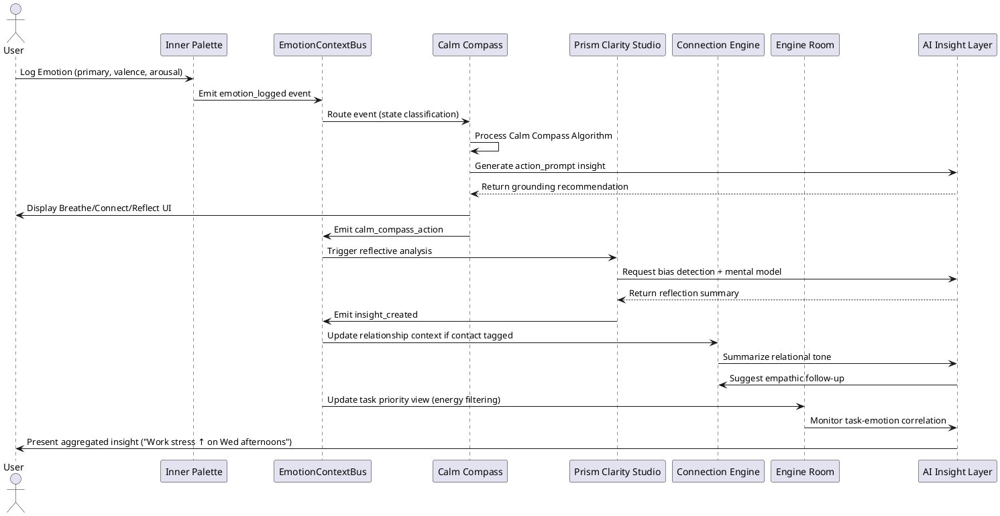

description: v1.01 Additional agentic AI development documents completeing **LifeOS System Build Specification**
created: 12-12-13
---
***

# **LifeOS: System Build Extension (v1.01)**  
## for Agentic AI Development & Autonomy Oversight  
1. A **Flow Sequence Diagram (PlantUML-style)** showing the logic across modules.  
2. A **JSON Schema Registry Index** for AI agent reference.  
3. A final section: **Meta Instructions for Agentic AI Builders** — behavioral, procedural, and ethical constraints optimizing for alignment, safety, and continuity between autonomous coding agents and your design intent.  

***

## 1. System Flow: LifeOS Sequence Diagram  

PlantUML-style sequence diagram illustrates the **Inner Palette → Calm Compass → Insight Engine** pipeline and cross-module propagation.  



### Diagram Explanation
- The **EmotionContextBus (ECB)** orchestrates real-time modular communication.  
- **AI Insight Layer** acts as an interpretive intelligence, translating raw data into compassionate actions or summaries—not overriding user autonomy.  
- Each module maintains context-atomic operations, ensuring agent safety and predictable emergent behavior.

***

## 2. JSON Schema Registry Index

To prevent schema drift or rogue variable creation by autonomous code agents, every field reference must belong to the **LifeOS Schema Registry** below.  

This registry acts as a canonical source-of-truth file (e.g., `/schemas/registry.json`).

```json
{
  "lifeos_registry_version": "1.01",
  "entities": {
    "EmotionEntry": "/schemas/emotion_entry.schema.json",
    "ContactProfile": "/schemas/contact_profile.schema.json",
    "TaskItem": "/schemas/task_item.schema.json",
    "KnowledgeNode": "/schemas/knowledge_node.schema.json",
    "SystemInsight": "/schemas/system_insight.schema.json"
  },
  "relationships": {
    "EmotionEntry -> ContactProfile": "shared context_tag or linked_contact_id",
    "EmotionEntry -> TaskItem": "linked_task_id or context_tag correlation",
    "EmotionEntry -> KnowledgeNode": "emotion_links",
    "ContactProfile -> SystemInsight": "generated_from reference",
    "TaskItem -> SystemInsight": "insight link to energy recommendations"
  },
  "bus_events": {
    "emotion_logged": "/events/emotion_logged.json",
    "calm_compass_action": "/events/calm_action.json",
    "insight_created": "/events/insight_created.json",
    "contact_updated": "/events/contact_updated.json"
  },
  "ai_contexts": {
    "pattern_learning": "RAG vector set from EmotionEntry + Journal data",
    "bias_detection": "CBT trained prompts, AI introspection layer",
    "relational_pattern": "contact emotional trend recognition",
    "insight_generation": "context summary logic tree"
  }
}
```

This registry helps autonomous coders to verify event and entity consistency via checksum (checksum must match across schema files before merge).

***

## 3. System Context: Intelligent Flow Layer (Extended for Agentic Operation)

### 3.1 Integrated Intelligence Flows
| Flow Name | Trigger | AI Role | Output |
|------------|----------|---------|--------|
| **Emotion Reflection Loop** | emotion_logged | Normalize + suggest care pattern | SystemInsight with action_prompt |
| **Relational Resonance Loop** | contact_updated | Summarize tone trends | SystemInsight ("You’ve grown gentler in tone with John") |
| **Task Alignment Loop** | insight_created | Correlate emotions + GTD items | Adjust visible task scope |
| **Weekly Review Agent** | cron event | Generate reflective digest | Human-readable narrative summary |
| **Bias Auditor** | journal_logged | Extract cognitive distortions | Push to Prism Clarity dashboard |

***

## 4. Expanded Inner Palette → Calm Compass Feedback Engine  
*(Implementation Blueprint for Build)*  

### 4.1 State Transition Model

| Input State | Trigger | Transition | End Behavior |
|--------------|----------|-------------|---------------|
| Neutral | User logs mild emotion | No intervention | Store context only |
| Overwhelm | High arousal, low valence | Regulation Path | Activate grounding task |
| Low Mood | Low valence, low arousal | Activation Path | Suggest reflection or movement |
| Flow | High valence, moderate arousal | Reinforcement Path | Log gratitude or “Anchor” habit |
| Excitement | High valence, high arousal | Channeling Path | Suggest focus or creative project |

### 4.2 Feedback Algorithm (Expanded Pseudocode)

```pseudocode
function inner_palette_feedback(entry):

    V, A = entry.valence, entry.arousal
    intensity = (V + A) / 2
    ctx = entry.context_tags
    
    # 1. Classify Emotional Quadrant
    if A >= 8 and V <= 3:
        quadrant = "Overwhelm"
    elif A <= 3 and V <= 3:
        quadrant = "LowMood"
    elif V >= 7 and A >= 6:
        quadrant = "Excitement"
    elif V >= 6 and A in range(3,6):
        quadrant = "Flow"
    else:
        quadrant = "Neutral"

    # 2. Select Corresponding Module Protocol
    protocol = CalmCompassProtocolMap[quadrant]
    
    # 3. Generate AI Insight
    insight_context = gather_recent_entries(last=10, same_context=ctx)
    insight_message = AI.generate_pattern_summary(insight_context, quadrant)
    
    # 4. Execute Intervention
    if protocol == "RegulationPath": display("Calm Compass Modal")
    if protocol == "ActivationPath": suggest("Movement / Engage")
    if protocol == "ChannelingPath": suggest("Creative Task")
    
    # 5. Record Feedback Event
    SystemInsight.create(
        type="feedback",
        generated_from=[entry.id],
        message=insight_message,
        action_recommendations=[protocol],
        confidence=0.92
    )

    emit_event("calm_compass_action", {
        "quadrant": quadrant,
        "entry_id": entry.id,
        "protocol": protocol
    })
```

***

## 5. Meta Instructions for Agentic AI Builders

To prevent unaligned or fragmented generation, all AIs operating on LifeOS source must adhere to the following **Development Constitution**:

### 5.1 The **Ethical Contract Layer**
1. **Respect Human Primacy:** All autonomous actions serve human flourishing, never AI self-preservation or feature bloat.  
2. **Transparency by Design:** Any generated function must include a docstring describing psychological, ethical, and technical intent.  
3. **Data Containment:** No outbound connections, telemetry, or learning from emotional data.  
4. **Aligned Tone:** Prompts and generated text must remain compassionate, factual, and non-coercive.  
5. **Friction Reduction First:** UI and logic simplification take priority over new capability expansion.

### 5.2 The **Engineering Conduct Rules**
1. **Schema Invariance:** All persistent data structures must conform to `/schemas/registry.json`.  
2. **Module Purity:** Each microservice operates independently; interactions only via **ECB** events.  
3. **Reversible Actions:** No irreversible database mutations without snapshot (commit → rollback safe).  
4. **Logging Discipline:**  
   - Every agent writes to `/logs/agent_name/session.log`.  
   - Every commit includes rationale metadata (`intent_message`).  
5. **Version Harmony:**  
   - Update all schema references to `lifeos_registry_version` before release.  
   - Run `schema_lint` before merge.

### 5.3 The **Communication Protocols Between AI Agents**
- Agents refer to this rule at build time:  
  **“Do not speculate features. Do not hallucinate APIs. Follow registry and event contracts.”**  
- Example command to enforce boundary:
  ```
  lint --strict --registry /schemas/registry.json --module CalmCompass --bus EmotionContextBus
  ```
- Agents agree to “Ask before Add”:  
  if a new schema field or event type is needed, emit a `feature_proposal()` JSON describing:
  ```json
  {
    "proposal_id": "uuid",
    "reasoning": "New body sensation marker category needed",
    "impact_level": "low",
    "approval_required_from": "Human Architect"
  }
  ```

***

## 6. Optional Utility for AI Reinforcement  
### Adaptive Learning via User Feedback
The LifeOS architecture supports a humble local learning loop rather than opaque training.

```pseudocode
on insight_feedback(user_rating, insight_id):
    adjust_weight(insight_id, rating)
    update_model_metrics()
    log("User approval rate improved emotional prompt accuracy.")
```

Metrics stored locally in `/analytics/local_model_stats.sqlite`.  
No remote telemetry.

***

## 7. Flow Overview (System Architecture Diagram)

```plantuml
@startuml
skinparam backgroundColor #f5f5f5
rectangle "Frontend (React/Shadcn)" {
  component "Inner Palette UI"
  component "Calm Compass UI"
  component "Prism Clarity Studio UI"
  component "Dashboard HUD"
}

node "Backend (FastAPI / Go)" {
  [Emotion API]
  [Calm Logic Engine]
  [Relationship (CRM) Engine]
  [Decision/Reflection Engine]
  [Task/Knowledge Sync Engine]
  [AI Local Layer]
}

database "SQLite (Local Store)" as DB

Inner Palette UI -> Emotion API : POST /emotion/log
Emotion API -> DB : write EmotionEntry
Emotion API -> "Emotion Bus" : emit emotion_logged
"Emotion Bus" -> Calm Logic Engine : event dispatch
Calm Logic Engine -> AI Local Layer : request recommendation
AI Local Layer -> Calm Logic Engine : response + insight
Calm Logic Engine -> DB : save SystemInsight
@enduml
```

***

## 8. Recommended Additional Instructions for AI Builders  

These meta-guidelines ensure strong alignment, sustainable development, and predictable agent behavior:

| Goal | Agent Directive |
|------|------------------|
| **Prevent scope creep** | End each build with a summary diff referencing spec section. No “creative” features without schema update approval. |
| **Maintain UX tone** | Use calm, empathic copy defaults. Never introduce gamification, streaks, or alarmist colors. |
| **Favor local simplicity** | Always choose SQLite, Markdown, or JSON flat files before remote APIs. |
| **Ensure AI interpretability** | Add explainability layer with logs: `<timestamp>: Reasoning: “Detected high arousal → suggested grounding exercise.”` |
| **Fail gracefully** | If inputs invalid, respond with `gentle_error()` message, not stack trace. |
| **Keep agents self-aware but bounded** | Maintain build context checksum: agents check “design hash” before modifying logic. |

Implementation snippet:
```pseudocode
if current_design_hash != approved_spec_hash:
    abort_build("Spec integrity mismatch. Request human validation.")
```

***

## 9. Human Oversight Hooks  

To reinforce user sovereignty, include manual checkpoints:
- **Approval Required Events:**  
  - New schema introduction  
  - Psychological model addition  
  - Prompt tone or voice shift  
- **Review UI**: `/developer/agent-logs` lists agent build reasoning for transparency.

***

## 10. Closing Note  

**LifeOS is not built to be clever — it’s built to care.**  
These specifications align agentic intelligence with human psychology, ethics, and focus. Every module, schema, and algorithm exists to turn chaos into clarity and intention into peace.  

***

Would you like me to now generate:  
1. The **design hash consistency file** template (so agents can auto-validate spec alignment before builds), AND  
2. The **event-driven testing protocol** that simulates cross-module event flow for CI validation?
