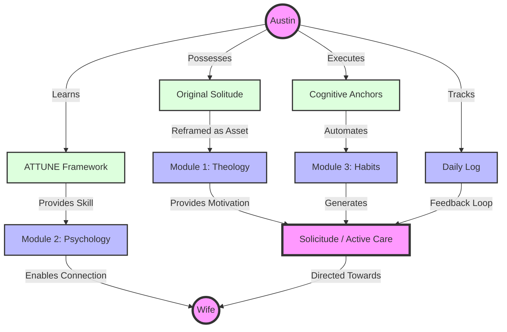

# 🗺️ The Architecture of Care

This map visualizes how the components of the **Engineering of Empathy** program interact to generate the virtue of Solicitude.

## 🔗 Key Connections
- **Original Solitude** is the *Input Source* (Your capacity for depth).
- **Solicitude** is the *Output Signal* (Directed attention).
- **Habits** are the *Transmission Lines* (Ensuring the signal reaches the receiver).
